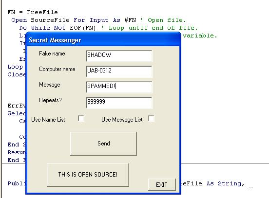



## a net send with cloaker

### Description

PLEASE VOTE AND COMMENT! This little proggie is a net sender with a cloaker! Net send is a dumb tool built in to all windows versions and automatically turned on, which lets people on the network comunicate with each other, but unless you are a pro, there is no way to stop receiving the messages! The cloaker hides the usual "From: Bob to Mike" and makes it "From: GOD to Mike". You can replace god with whatever you want. This program comes complete with message and name cycling, and you can send multiple messages at a time (10000 per second i beleive). I once spammed the whole school network (it a big high school with over 2500 ppl) with 1 million messages. To use it, just Type your fake name (or if you wana use a list check the box name list and edit the txt file attached to this called namelist.txt), their Computer name, your message (or check message list and do the same thing as name list) and then number of times and then bang, your messages are sent.
 
### More Info
 
Dont get caught doing this!

             |
---                |---
**Submitted On**   |2004-03-14 09:09:02
**By**             |[QWERTY UIOP](https://github.com/Planet-Source-Code/PSCIndex/blob/master/ByAuthor/qwerty-uiop.md)
**Level**          |Intermediate
**User Rating**    |5.0 (55 globes from 11 users)
**Compatibility**  |VB 3\.0, VB 4\.0 \(16\-bit\), VB 5\.0, VB 6\.0
**Category**       |[Jokes/ Humor](https://github.com/Planet-Source-Code/PSCIndex/blob/master/ByCategory/jokes-humor__1-40.md)
**World**          |[Visual Basic](https://github.com/Planet-Source-Code/PSCIndex/blob/master/ByWorld/visual-basic.md)
**Archive File**   |[net\_send\_w1719713132004\.zip](https://github.com/Planet-Source-Code/qwerty-uiop-a-net-send-with-cloaker__1-52354/archive/master.zip)

